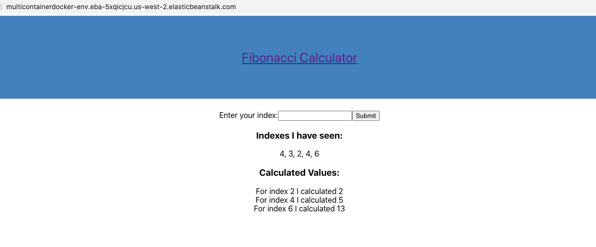
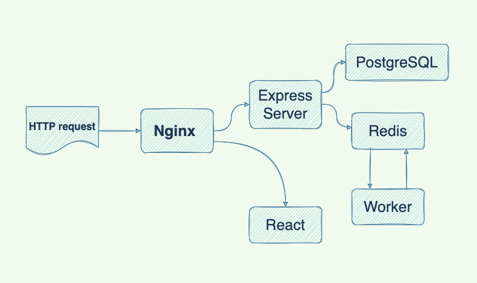

# Multi-container docker

#### Deploy a multi-container-docker application to AWS

The application uses several docker containers, including a <strong>React</strong> front-end UI container, a <strong>NodeJS</strong> back-end api container, a <strong>Redis</strong> container storing information about the calculated results, a <strong>PostgreSQL</strong> container permanently storing the indexes that have been calculated before, a worker container which is essentially another <strong>NodeJS</strong> back-end container responsible for implementing the logic of calculating Fibonacci numbers and a <strong>Nginx</strong> container in charge of routing incoming HTTP requests.

The workflow is as such: when a HTTP request reaches the front-end, the Nginx container routes the request to the React container or the NodeJS back-end server, based on the URL. If the URL contains 'api', then the Nginx server sends the request to the back-end server. The back-end server stores the requested Fibonacci index number in the PostgreSQL database, calculates the Fibonacci number, stores the index-value combination in the Redis datastore, and finally responds to the request with all the information retrieved from the Redis datastore and PostgreSQL database.

| |
|:--:|
| *Workflow Diagram*|

The deployment follows a <strong>CI/CD</strong> pipeline workflow using <strong>Github<strong>, <strong>TravisCI<strong>, and <strong>AWS</strong> that will automatically deploy the application after changes are made.

The whole process requires the following steps:

1. Create an Elastic Beanstalk application. Select Docker as platform and Multi-Container Docker as platform branch.

2. Create RDS PostgreSQL database.

3. Create a Redis database in ElasticCache.

4. Create a security group that allows communication between Elastic Beanstalk, PostgreSQL and Redis created in step 1-3.

5. Apply the security group created in 4 to Elastic Beanstalk, PostgreSQL, and Redis respectively.

6. Set environmental variables for Elastic Beanstalk, including PostgreSQL host, port, database name, username and password, and Redis host and port.  

7. Create an IAM user for the application.

8. Add AWS configurations(app name, env name, bucket name, bucket path, region, user access key, user access secret) to .travis.yml file.

9. Set environmental variables for IAM user in Travis CI.

10. Push code changes to Github and the application will be deployed.
